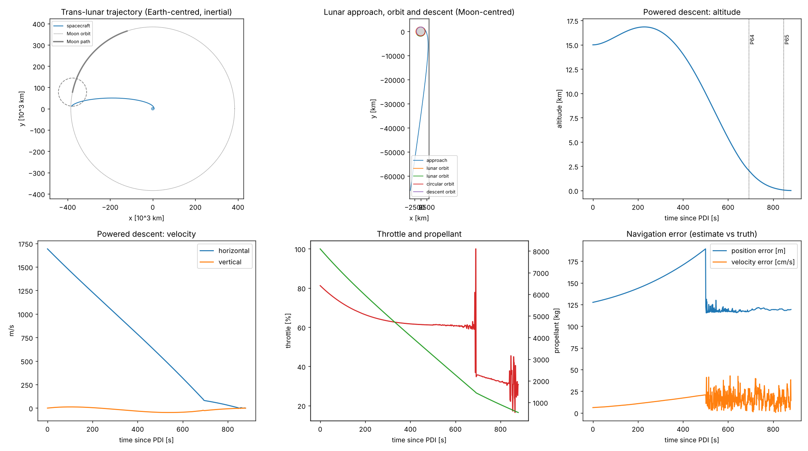

# MOON -- fly a spacecraft from the Earth to the Moon, and land it

`moon_sim.ady` is a small flight simulator. It does not draw a game: it works out, with the real laws
of gravity and the rocket equation, what an Apollo-style mission would do, prints each step, and at
the end draws six plots. It takes about 2.5 seconds to run.

    ady2nim c -r moon_sim.ady --out moon_mission.png

No spaceflight knowledge is assumed below.

## The idea in one picture

Nothing flies in a straight line. A spacecraft is thrown towards the Moon by one big push, then
**coasts for about five days** while Earth's and the Moon's gravity bend its path. Near the Moon it
slows down with rocket burns so that the Moon's gravity can catch it, and it settles into a circle round
the Moon. A lander then separates, drops out of that circle, and flies down to the surface with its
engine pointing against its motion.

```
                                  the Moon's orbit round the Earth (a circle, 384 000 km across)
                                 .  .  .  .  .  .  .
                            .                           .
                        .                                  .
                      .                                       .
                     .                     coast, ~4.5 days   [Moon]  <-- the spacecraft arrives
                    .              _____ . - - - - - - - - -> (O)         here, and is captured
                    .         . ' '                                       .
                    .      .'                                             .
                     .    /                                              .
        LEO 200 km    .  |  [Earth]                                      .
      ( a small circle )  \                                              .
                      .    '.                                         .
                        .                                          .
                            .                                  .
                                 .  .  .  .  .  .  .

     TLI = "trans-lunar injection": the big push that leaves the 200 km parking orbit
```

(The sketch is not to scale: the real Moon is 384 400 km from the Earth, the spacecraft starts only
200 km above the ground.)

## The mission, step by step

Every line below is one thing the program prints. A **burn** is a rocket firing; its size is measured by
**delta-v**, the change of speed it gives, in metres per second. Bigger delta-v needs more fuel.

```
 1. TLI    Leave the Earth.   3133 m/s of delta-v from the third stage (S-IVB), which is then dropped.
    |
 2. COAST  About 4.6 days with the engine off. The program steps the real motion forward in time,
    |      under the pull of both the Earth and the Moon (which moves along its own orbit meanwhile).
    |
 3. SOI    "Sphere of influence": the point where the Moon's pull starts to matter more than the
    |      Earth's. 66 000 km from the Moon, at 890 m/s relative to it.
    |
 4. LOI-1  "Lunar orbit insertion": slow down by 771 m/s at the closest point (100 km above the
    |      surface), or the spacecraft would fly past. Now it is orbiting the Moon in an oval.
    |
 5. LOI-2  A small second burn (42 m/s) makes the oval a circle, 100 km above the surface.
    |
 6. UNDOCK The lander (LM) separates from the command ship (CSM), which stays in orbit.
    |
 7. DOI    "Descent orbit insertion": a 19.5 m/s nudge that lowers the lander's closest point to 15 km.
    |
 8. PDI    "Powered descent initiation": at that low point, 625 km before the landing site, the lander
           fires its engine for about 15 minutes and lands.
```

The size of each burn comes from the **rocket equation**: the fuel used is `m0 * (1 - exp(-dv / ve))`,
where `m0` is the mass before the burn and `ve` the speed of the exhaust. That is why the heavy first
burn needs 68 tonnes of propellant and the last one only 97 kg.

### Why "shooting"?

The Moon is moving while the spacecraft coasts. For the spacecraft to arrive at exactly 100 km above
the surface, it must leave the Earth when the Moon is at the right place on its orbit. The program does
not know that angle, so it tries a value, flies the whole coast, sees how far off the arrival is, and
adjusts, until the miss is zero (a root finder, Brent's method). It comes out as a correction of about
-6.1 degrees. Nothing is "teleported" to make the arrival work.

## The landing: a robot pilot

The last ten minutes are the interesting part. The lander is slowed from **1693 m/s** (faster than a
rifle bullet) to about **1 m/s**, in 15 km of height and 625 km of distance, by a pilot that is a
program. It repeats one loop many times a second:

```
        +---------+   what the instruments say    +------------+
        | physics |  -------------------------->  |    IMU     |  sensors: they measure the
        | (truth) |      (acceleration, with      +------------+  push on the craft, with a little
        +---------+       a little noise)               |         random error
            ^                                           v
            |                                    +------------+
            |                                    | Navigation |  "where am I, how fast?" an
            |                                    +------------+  estimate: it drifts, so it is
            |                                           |         corrected from time to time
            |                                           v
    +------------+     the engine's push          +------------+
    | Propulsion |  <---------------------------  |  Guidance  |  "where should I be going?" picks
    +------------+                                +------------+  a direction and a thrust to hit
            ^                                           |         the landing spot
            |              +------------+               |
            +------------  | Autopilot  |  <------------+
                           +------------+   "turn the nose that way"
```

* **Physics** is the truth: where the lander really is.
* **IMU** (inertial measurement unit) is what the lander can feel, with random noise added.
* **Navigation** turns that into a *belief* about position and speed. The belief is a little wrong, and
  the sixth plot shows by how much (about 120 m and 0.12 m/s at touchdown).
* **Guidance** compares the belief with where the lander wants to be and chooses a thrust direction and size.
* **Autopilot** turns the craft to point that way, and **Propulsion** burns fuel and pushes.

The descent has three phases, as in Apollo, named after computer programs of the real lander:

```
   altitude
   15 km  *                                         P63  BRAKING:  kill the 1700 m/s sideways speed,
          |  *                                                     engine nearly flat out
          |      *
          |           *
    2 km  |                 * - - - - - - - -  P64  APPROACH:  ~90 m/s, aim at the landing spot
          |                              *
   55 m   |                                 * - -  P65  TERMINAL:  ~5 m/s, come in gently
    0     +--------------------------------------*  touchdown, ~1 m/s
          0 km                                 625 km        distance along the ground
```

Noise is generated from a fixed **seed**, so the same seed gives the same landing every time
(`--seed N` changes it).

## What the program prints

```
TLI dv = 3133.1 m/s            <- the push that leaves the Earth
ENTERED LUNAR SOI   66170 km   <- the Moon's gravity starts to win
LOI-1 dv = 770.6 m/s           <- slow down to be captured
LOI-2 dv = 41.6 m/s            <- make the orbit a circle
DOI dv = 19.5 m/s              <- lower the lander's low point to 15 km
t+ 692s P64-APPROACH ...       <- phase changes, with altitude, speed and fuel left
TOUCHDOWN
  Contact velocity : -0.86 m/s vertical, -1.15 m/s horizontal    <- gentle enough to land
  Landing miss     : -236 m (+ = long)                           <- how far from the target spot
  Descent prop left: 533 kg                                       <- fuel still in the tank
Mission time : 132.60 h (5.53 d)
```

## The six plots (`moon_mission.png`)

```
 +----------------------------+----------------------------+----------------------------+
 | 1. The trip to the Moon,   | 2. The approach, the circle| 3. Descent: altitude over  |
 |    seen from the Earth     |    and the descent seen    |    time. Dotted lines mark |
 |    (the Moon's own orbit   |    from the Moon           |    the P64 and P65 phases  |
 |    dotted, its path grey)  |                            |                            |
 +----------------------------+----------------------------+----------------------------+
 | 4. Descent: horizontal and | 5. Throttle (% of full     | 6. Navigation error: how   |
 |    vertical speed. The     |    thrust) and propellant  |    far the lander's belief |
 |    sideways speed is cut   |    left (kg). The spikes   |    is from the truth, in   |
 |    almost to nothing       |    are the pilot adjusting |    metres and cm/s         |
 +----------------------------+----------------------------+----------------------------+
```



## What the code is made of

The program is about 1400 lines. Reading it top to bottom follows the story:

| part of `moon_sim.ady` | what it does |
|------------------------|--------------|
| units (`Mass_T`, `Force_T`, `Mu_T`, ...) | every number carries its unit, so a speed cannot be added to a mass, and the compiler checks it |
| constants, `vis_viva`, `orbital_elements` | the physics of orbits: how fast to go at each height, the shape of an orbit |
| `integrate`, `brentq` | the equation solvers: advance the motion in small adaptive steps, and find the Moon's starting angle |
| `Spacecraft`, `Stage_T` | the ship's stages, their masses and engines, and the rocket equation |
| `Mission` | the sequence above, from TLI to the descent |
| `IMU`, `Navigation`, `Guidance`, `Autopilot`, `Propulsion` | the landing pilot |
| the plotting at the end | the six plots |

The units are the point of the exercise: the program is a test that Adascript can handle a real
calculation with checked units (metres, seconds, kilograms, degrees) on one of its two backends.

---

## About this translation

`moon_sim.ady` is `moon_sim.py` (a 2-D, Apollo-style mission: TLI, a trans-lunar coast,
LOI-1/LOI-2, undock, DOI, then a closed-loop powered descent through
IMU -> Navigation -> Guidance -> Autopilot -> Propulsion) written in Adascript.

    ady2nim c -r moon_sim.ady --out moon_mission.png      # about 2.5 s
    make test-moon

**Nim only**: it imports `MAP_UTILS/map_base.ady` and `map_flat.ady` for its units and flat-plane geometry, and those
files are Nim only (they do `from math nimport ...`; `ady2py` cannot run it). The first version of this
example had its own `Vec2` and ran on both backends, with identical output; this one trades that for
the shared types.

The deterministic part of the mission is the original's to the digit (TLI 3133.1 m/s, LOI-1 770.6,
LOI-2 41.6, DOI 19.5, perilune 100.0 km at 2446.1 m/s, mission time 132.60 h); `make test-moon`
checks those lines. The powered descent is noisy, so its landing differs a little from the original's
(seed 1: 880 s, -0.86 m/s vertical, 533 kg of propellant left, against 868 s, -1.13 m/s, 601 kg) and
the six plots have the same shape as `moon_mission.png`. Matplotlib is needed to plot, through
`pyimport`; `make test` skips the run when it (or nimpy) is not installed, and only compiles.

## What differs from the Python

| moon_sim.py | here |
|-------------|------|
| `scipy.integrate.solve_ivp(..., method="DOP853", events=...)` | `integrate`: an adaptive Dormand-Prince 5(4) with terminal events, found by bisection. scipy cannot be called from Nim with a callback, and writing it in Adascript made the Nim build possible. Same tolerances (rtol 1e-10, atol 1e-3, max step 1800 s / 30 s); the orbit comes out the same to the printed digits |
| `scipy.optimize.brentq` | `brentq`, Brent's method, ported |
| numpy arrays | map_flat's `Position` (a point) and `Vector` (a displacement); `State_T` is a position and a velocity, `Delta_T` what it changes by per second. numpy is not imported at all |
| `np.random.default_rng(seed)` | `Rng`, L'Ecuyer's combined generator with Box-Muller, so the Python and Nim runs draw the same noise. The descent's noise therefore differs from numpy's for the same seed |
| `Stage` dataclass, `Spacecraft` | `Stage_T`, a record whose fields are `Mass_T`, `Duration_T` and `Force_T`, held by `Spacecraft`. The original shares one `Stage` object between the stack, the burn and `Propulsion`; here a stage is found by its `StageId_T`, so nothing is shared |
| `dict(...)` for orbital elements, gates, telemetry | records: `Elements_T`, `Gate_T`, `Target_T`, `Telemetry_T`, `Result_T` |
| strings for stage names, burn labels, guidance modes, phases | enums (`StageId_T`, `Burn_T`, `Mode_T`, `Phase_T`, `Event_T`) with name tables (`STAGE_NAME`, `BURN_NAME`, `MODE_NAME`) |
| event functions with `.terminal` / `.direction` attributes | `Event_T` and `EVENT_DIRECTION`; a `Dynamics` class (`EarthDynamics`, `MoonDynamics`) says what it watches |
| `lambda d: self._signed_periapsis(d) - target` | `PhaseError`, a `Scalar_Fn` with a `value` method: functions here do not close over variables |
| `float("nan")` for "no arrival" | `?float` from `signed_periapsis`, `1e30` where Brent needs a number |
| `orbital_elements` also returned `a`, `energy`, `apoapsis` | only what the program reads: radius, speed, `h`, `e`, periapsis |
| `Guidance.t_go` is `None` until set | `t_go` and `has_t_go` |
| `argparse` | a small loop over `$@` with an enum for what is expected next |

## Units

No bare floats in signatures. From map_base and map_flat: `Meters_T`, `Degrees_T`, `SquareMeters_T`, `Vector`,
`Position`, `Kilometers_T` and `Radians_T` (scaled units: `Kilometers_T(m)`, `Degrees_T(r)`), `modulo`, and `rotated_by` / `angle` / `unit` / `cross` for the rotations and
signs the original did with `rot`, `arctan2` and `np.sign`. Declared here: `Mass_T`, `Duration_T`
(distinct), `Speed_T`, `Accel_T`, `Force_T`, `Mu_T` (a body's GM), `AngularRate_T` and `AngMom_T` (derived).
The rocket equation is `ve = isp * G0` (a `Speed_T`), `used = m0 * (1 - exp(-dv / ve))` (a `Mass_T`),
gravity is `MU_MOON / (r * r)` (an `Accel_T`), the Moon's phase is a `Degrees_T` advancing at an
`AngularRate_T`, and a burn's delta-v cannot be added to a mass.

Two places still go through plain floats, inside a function that has typed parameters and result:
`sqrt`, `exp`, `ln` and `**` (`vis_viva`, `half_period`, the Moon's mean motion), and the arithmetic of
the integrator and Brent's method, which is on dimensionless step fractions.

Velocities and accelerations are map_flat's `Velocity` (`Speed_T` along a bearing) and
`Acceleration` (`Accel_T` along a bearing), with `Vector / t -> Velocity`,
`Velocity * t -> Vector`, `Velocity / t -> Acceleration` and `Acceleration * t -> Velocity` (`*` and `/` are
overloaded on the type of the right-hand side: a plain number scales, a `Duration_T` changes the unit);
the integrator's state is a `Position` and a `Velocity`, and a step of it is a `Vector` and a `Velocity`.
So `r + v * dt` checks, and `r + v` does not.

## Transpiler gaps met on the way

The units items below were fixed in the transpiler (`EXAMPLES/test_units_fields.ady`); the rest have a workaround in the source, marked where it is.

* **`(a, b) = f()` inside a block, onto variables declared outside it, made new variables on
  Nim** (`var (a, b) = ...`) and left the outer ones as they were. Silent: guidance flew to a
  target of zeros and the lander hit the Moon at 300 m/s. Fixed in the transpiler; the source still
  returns a record and assigns (`Guidance.compute`'s `aim`).
* **`(self.r, self.v) = f()` was not seen as a write to `self`**: the method got a plain `self` and
  Nim refused to compile it. Fixed in the transpiler; `Navigation.propagate` still assigns one at a time.
* **Methods in a `record` body were dropped without a word**, on both backends; both now refuse
  them and say to write a function or use a class. The first version's vector had to be a class.
* **Classes are values on Nim, references on Python** (chapter 13): `Rng` and `Spacecraft` are shared,
  so they are `@virtual`.
* **Units**: `SquareMeters_T * Meters_T` has no unit (a chain is two-at-a-time), so a cube is taken
  through `float`. Three others were fixed here: a literal beside `>` on a distinct type in a
  conditional expression or on a tuple-unpacked name came out as `0.0 < force`; a bare `0.0` in a
  returned tuple `(int, Force_T)` was not converted; and the Python unit check did not know a record
  field's type (`st.isp * G0`).
* **`{x:,.0f}` and `{x:+.0f}` in an f-string**: Nim had no `,` flag, and `+.0f` left a stray `.`
  (`-456396.`). Fixed in the transpiler, with a width and alignment too (`{x:15,.1f}`); the source
  writes them as Python does. `\n` in an f-string was fixed some time before.
* **A call on a `PyObject` variable standing alone (`ax.plot(...)`) was "has to be used" on Nim**
  (only a call on a pyimported module was discarded). Fixed in the transpiler; the plots are written
  as plain calls.
* **`Record(a, b, None)` with a positional `None` for a `?T` field emitted `nil` on Nim, and
  `opt == value` / `opt != value` on a `?Enum` did not compile.** Fixed in the transpiler (the field is
  lifted to `none(T)` or `some(v)`, positional or by name; the value beside `==` is lifted to
  `some(v)`).
* **`a + b` on two `[]T` fields reached through `self.x.y`** was not seen as a list concatenation on
  Nim (`&`). Fixed in the transpiler.
* **`min(a, b, c)` with three arguments, and `raise NotImplementedError()` without a message,
  did not compile on Nim.** Fixed in the transpiler (nested two-argument calls; the exception's name
  as its message, and `except NotImplementedError` catches it).
* **`math.atan`, `atan2`, `asin`, `acos` and one-argument `math.log`** are Python's names, not Nim's
  (`arctan`, `arctan2`, `arcsin`, `arccos`, `ln`). They are now refused with what Nim calls them, and
  `math.arctan` and the others run on the Python backend too.
* **map_base and map_flat cannot be imported from a sibling directory by name**; `from MAP_UTILS/map_base import`
  works because the parent of this directory is searched.
